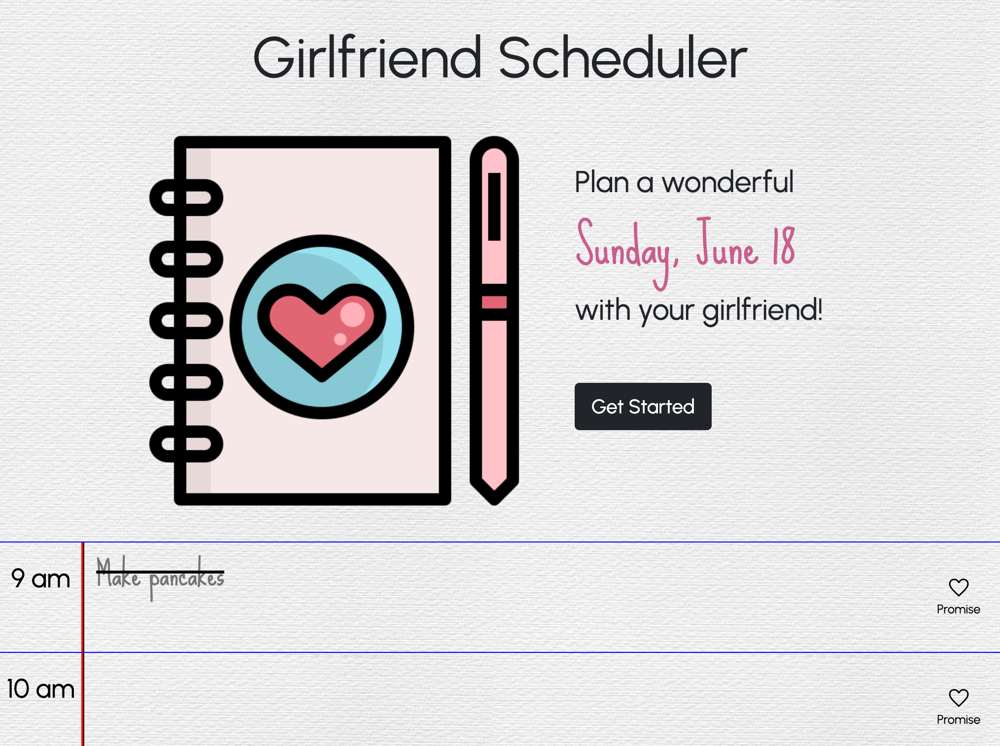
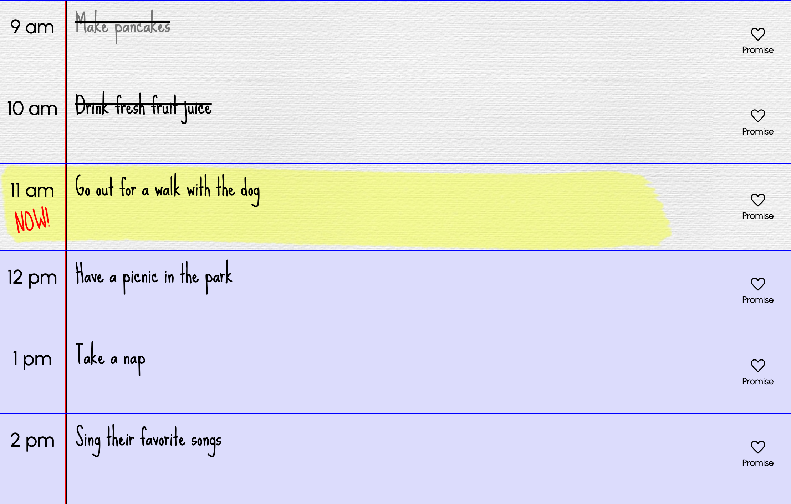

# Girlfriend Scheduler

## Description

[Click here to visit the live website.](https://jacob-medina.github.io/girlfriend-scheduler/)

Schedule a wonderful day with your girlfriend using this simple planner app. Jot down activities to do each hour of the day, and the planner will keep you on track with live updates.

The aim of this project is to provide a themed planning experience to inspire fun and thoughtfullness in scheduling a day your partner.

Using Day.js, Girlfriend Scheduler automatically updates to the user's current date and time to inform them if activities are in the past, present, or future. When the user "Promises" to do an activity, it is saved to their local storage and persists between sessions.

## Usage

Users may do the following:

- Resize the window to get a layout that is appropriate for the screen dimensions
- Click the **Get Started** to scroll down to the scheduler section of the website
- Click and type inside a time block to add an activity to it
- Click the **Promise** button to save the activity

## Code Source

The three files that were edited in this project were `index.html`, `style.css`, and `script.js`.

These files can be found through the following path (from root):

- `index.html`
- `assets/css/style.css`
- `assets/scripts/script.js`

## Credits

The images used in this project are not mine. Here is the information for them:
- White Paper Background
  - > Creator: [kues](https://www.freepik.com/author/kues)
    >
    > Link: [https://www.freepik.com/free-photo/white-paper-background_932597.htm](https://www.freepik.com/free-photo/white-paper-background_932597.htm)
- Planner and Pen Icon
  - > Creator: [dDara](https://www.flaticon.com/authors/ddara)
    >
    > Link: [https://cutewallpaper.org/24x/8hxyrt5ch/1780132511.html](https://www.flaticon.com/free-icon/wedding-planner_1907988)

- Highlight Mark
  - > Link: [https://cutewallpaper.org/24x/8hxyrt5ch/1780132511.html](https://cutewallpaper.org/24x/8hxyrt5ch/1780132511.html)

The fonts used in this project are from [Google Fonts](https://fonts.google.com/), listed below:
- Urbanist
- Sue Ellen Francisco
- Klee One

The following APIs were used to assist in the development of this project:
- [jQuery](https://jquery.com/)
- [Bootstrap](https://getbootstrap.com/)
- [Day.js](https://day.js.org/)

Starter code created by edX Boot Camps LLC.